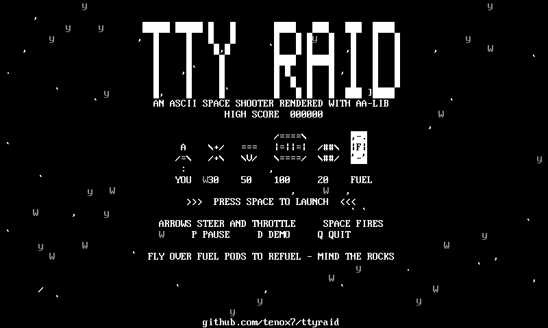
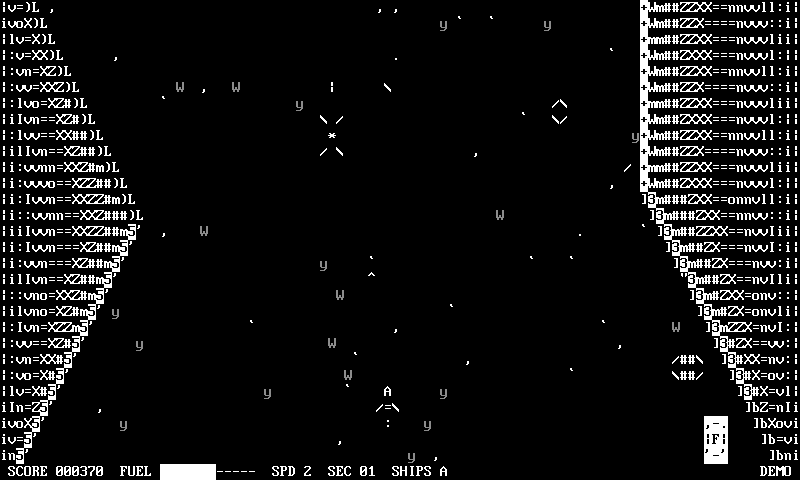

# TTY Raid

River Raid in ASCII art. The game draws grey pixels into
[AA-lib](https://aa-project.sourceforge.net/aalib/)'s virtual framebuffer and
lets AA-lib pick the character that best matches each cell, so the canyon walls
get real slopes and the sprites get shading. Plain C, no curses.





## Build and run

```sh
make && ./ttyraid
```

Needs aalib (`brew install aalib`, `apt install libaa1-dev`). The terminal back
end is `aatty.c`, a pair of AA-lib drivers that speak raw ANSI, so nothing but
libaa and libc is linked in — no ncurses, no terminfo.

```
ARROWS  steer and throttle    SPACE  fire
P pause    Q quit    D demo    Ctrl-L redraw
```

Fly over fuel pods to refuel, shoot everything else, don't hit the rocks. New
sector every 800 rows, extra ship every 10000 points. `-h` lists the options:
`-d` attract mode, `-f` Floyd-Steinberg dithering, `-b`/`-c`/`-g` brightness,
contrast and gamma, `-s FILE` / `-p FILE` dump one frame as text or as a PGM.

## Docker

```sh
docker build -t ttyraid . && docker run --rm -it ttyraid
```

A `scratch` image holding one 1 MB static binary. Nothing else is in there.

## Art

The canyon, the stars and the title logo are grey pixels run through AA-lib.
The cast is literal character art in `ttyraid.c` — the ship is ` A ` over
`/=\` — stamped into the text layer afterwards so the ships stay crisp over
the dithered rock. `make shots` regenerates the screenshots above.

## Family

An ASCII cousin of [vtraid](https://github.com/tenox7/vtraid), which does the
same thing with DEC VT soft fonts.

## License

Public domain / do what you want.
